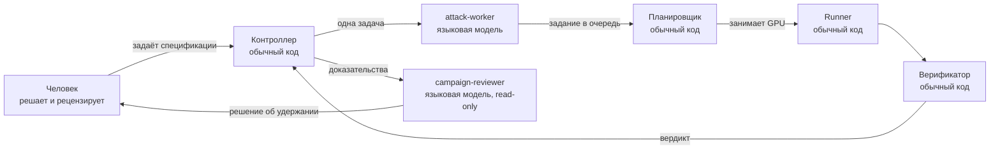
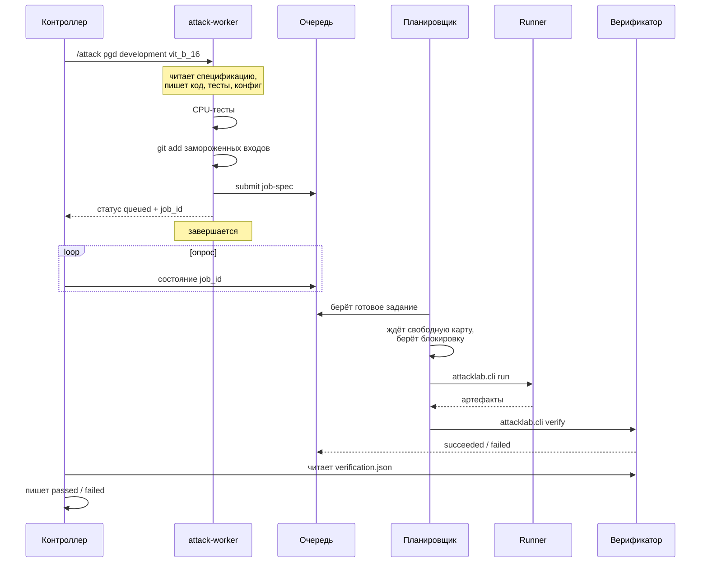
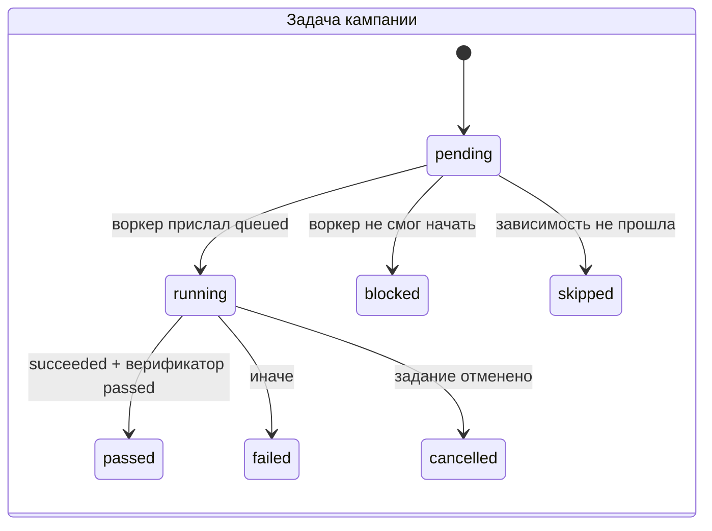
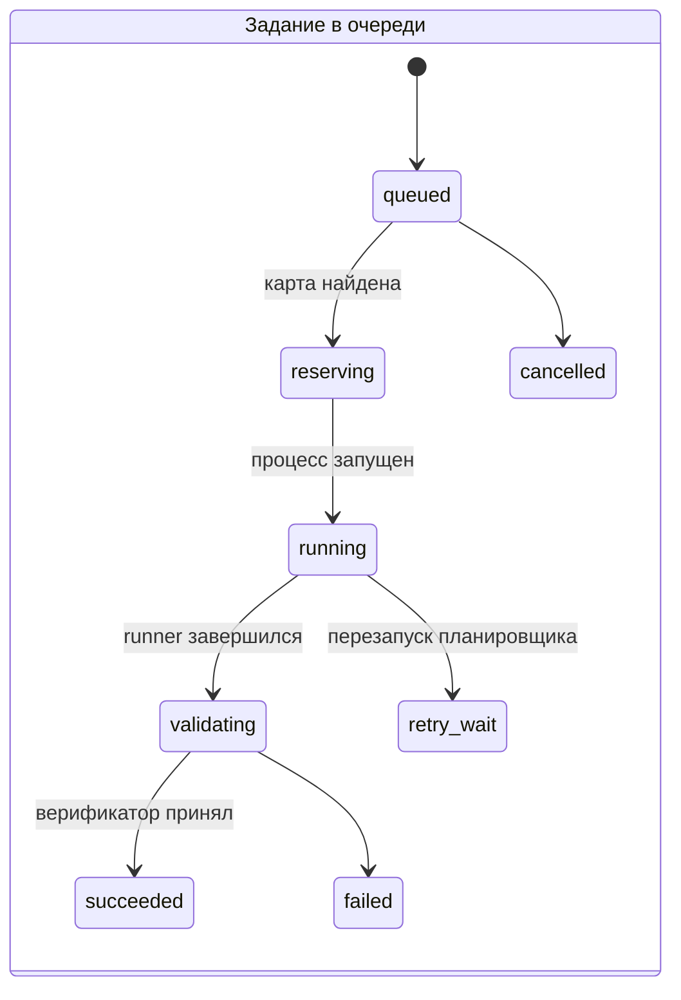
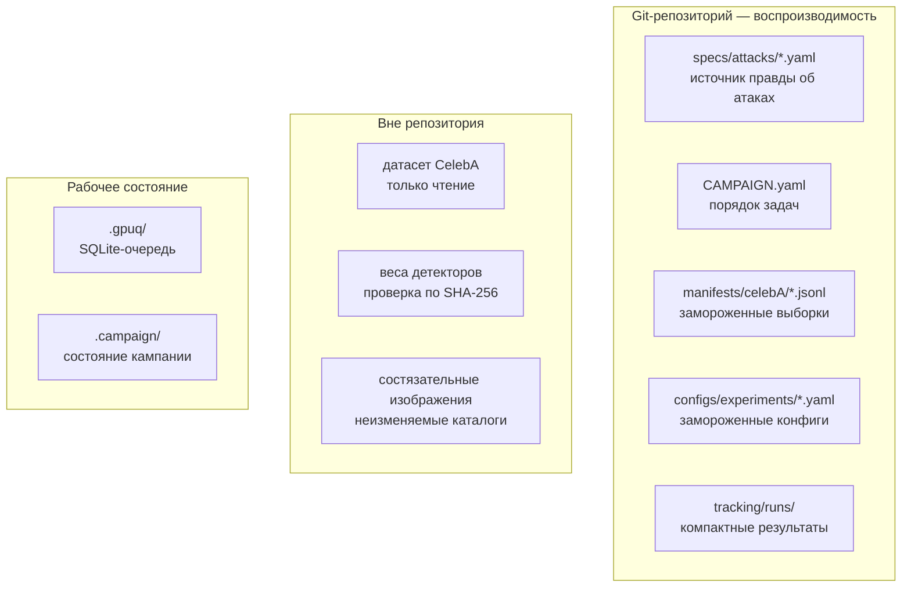
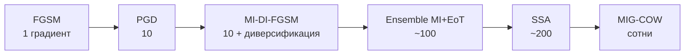

# Агентная система запуска состязательных атак

Описание устройства целиком: зачем построено именно так, кто что делает, как
проходит одна задача и какие гарантии обеспечены. Схемы — в Mermaid, их можно
рендерить как есть.

---

## 1. Задача и почему нужна система

Проверяется уязвимость детекторов дипфейков к состязательным атакам. Атака —
это незаметное изменение пикселей, после которого детектор ошибается.

Главный научный вопрос — **переносимость**. Атака, работающая только против
модели, по которой строилась, говорит о слабости конкретной сети. Атака,
переносящаяся на модель другой архитектуры, указывает на общую уязвимость.

Написать скрипт, который считает атаку, — полдня. Система нужна из-за другого:
**результату должны верить через полгода**. Отсюда три требования, каждое из
которых порождает часть архитектуры:

| Требование | Что было бы без него |
|---|---|
| Связь чисел с настройками неразрывна | конфиг правят на диске, и непонятно, чем получены числа |
| Бюджет искажения соблюдён точно | атака, вышедшая за бюджет, несравнима с остальными |
| Два одинаковых запуска дают одно и то же | непонятно, что вообще измерено |

И четвёртое, ради чего появилась именно **агентная** архитектура: код атак
пишет языковая модель, а языковой модели **нельзя доверять вердикт о
результате**.

---

## 2. Действующие лица

**Человек** пишет спецификации атак и принимает решения, которые нельзя
делегировать: какие изображения составляют выборку, какие пороги удержания,
когда авторизован полный прогон.

**Контроллер** (`scripts/run_campaign.py`) — обычный код, не ИИ. Раздаёт задачи
по одной, ждёт результат, сверяет вердикт верификатора и владеет durable
состоянием кампании.

**attack-worker** — языковая модель в изолированной сессии. Читает
спецификацию, пишет код атаки, тесты и замороженный конфиг. **Не выбирает GPU и
не запускает эксперимент.** Ставит задание в очередь и завершается.

**Планировщик** (`ops/gpuq/`) — единственный, кто занимает GPU. Ждёт карту с
достаточной свободной памятью, берёт на неё блокировку, запускает фиксированную
команду.

**Runner** (`attacklab/runner.py`) считает эксперимент. **Верификатор**
(`attacklab/artifacts.py`) перечитывает результат с диска и выносит вердикт.

**campaign-reviewer** — языковая модель без права записи. Применяет заранее
объявленные пороги к проверенным доказательствам.

---

## 3. Путь одной задачи

Ключевой момент: **воркер выходит после submit**. Он не ждёт GPU, не знает
результата и не может его объявить.

---

## 4. Два конечных автомата

Задача в кампании и задание в очереди живут отдельно.

Воркеру разрешены **только** `queued`, `failed`, `blocked`. Состояния
`running`, `passed` и `cancelled` принадлежат контроллеру.

---

## 5. Что где хранится

В Git — всё, что нужно для воспроизведения, и ничего тяжёлого. Каталоги с
изображениями адресуются хешем конфига и **неизменяемы**: повторный прогон с
тем же конфигом падает, а не перезаписывает.

---

## 6. Шесть гарантий и чем каждая обеспечена

| Гарантия | Механизм | Что будет при нарушении |
|---|---|---|
| Числа связаны с настройками | `_require_tracked_inputs`: входы обязаны быть в Git | эксперимент не стартует |
| `passed` не подделать | контроллер отвергает `passed` от воркера | задача падает |
| GPU занимает только планировщик | воркеру запрещены CUDA-команды и `nvidia-smi` | нет доступа к инструменту |
| Бюджет соблюдён | L∞-проекция после каждого шага плюс аудит перечитанного PNG | `constraint_violations > 0`, вердикт `failed` |
| Результат не перезаписать | каталог прогона неизменяем | падение при повторе |
| Атаки сравнимы между собой | общий дифференцируемый препроцессинг | атака со своей копией несравнима |

Отдельно: **воспроизводимость проверена эмпирически**. Два одинаковых прогона
дали побайтово совпадающие изображения, 8 из 8 хешей.

---

## 7. Что получилось на практике

Кампания из 27 задач: шесть методов атак, каждый в двух направлениях
(градиент от пространственного детектора и от частотного), в двух масштабах.

Двенадцать научных прогонов по 100 изображений, все с вердиктом `passed` и
нулевыми нарушениями бюджета.

Матрица переноса, лучшее по клетке. Строки — источник градиента, столбцы — где
измеряли:

| | ViT | DCT |
|---|---|---|
| **ViT** | 0.870 | 0.040 |
| **DCT** | 0.000 | 0.320 |

**Диагональ работает, недиагональ — нет.** Перенос между пространственным и
частотным детектором не происходит: лучшее значение 0.040, а в направлении
DCT→ViT ровно ноль у всех шести атак, включая спроектированные ради
переносимости.

Сильнейшая в белом ящике — SSA, работающая в частотной области: 0.870 и 0.320.
Работа с частотами помогает атаковать, но не переносить.

---

## 8. Чему научила эксплуатация

Кампания останавливалась пять раз. **Ни одна остановка не была поломкой
системы** — все были дефектами конфигурации или формулировок инструкций.

| Что остановилось | Причина |
|---|---|
| первый прогон агента | конфиг не в Git, а коммитить агенту запрещено |
| планировщик | не брал карты без флага совместного использования |
| tmux-сессия | `tee` писал в несуществующий каталог |
| тесты агента | системный интерпретатор без зависимостей проекта |
| статус задачи | двусмысленная фраза в инструкции, агент записал не тот файл |

Общее наблюдение: **останавливалось именно то, что должно останавливаться**.
Система ни разу не выдала неверное число и ни разу не пошла дальше вслепую.
Показательный случай — последний: агент реализовал атаку, прогнал тесты и
успешно посчитал эксперимент, но записал статус не по тому пути. Контроллер
отказался считать задачу выполненной, хотя наука была сделана.

---

## 9. Границы

Что система **не** обеспечивает, и это нужно знать при чтении результатов:

**Матрица неполна по детекторам.** Подключены два, веса ещё двух (NPR, AIDE)
есть, адаптеров нет. С двумя моделями перенос измеряется единственной парой, а
ансамблевые методы вырождаются: leave-one-detector-out оставляет один источник.

**Отложенной выборки нет.** Все методы сравнивались на одних и тех же 100
изображениях, на них же приведены результаты. Подгонку ограничивает то, что
параметры заданы заранее в спецификациях и не подбираются по ответам
детекторов.

**Конфаунд по формату данных.** В наборе все настоящие изображения — JPG, все
поддельные — PNG. Метка предсказывается по расширению файла, без анализа
пикселей. Чистая точность детекторов 1.000 может отражать сжатие, а не
распознавание подделки.

**Контроллер последовательный.** Один агент за раз. Параллельные воркеры
требуют отдельного git worktree каждому, иначе они переедут друг другу файлы.

**Изоляция агента — не песочница ОС.** Права OpenCode снижают риск случайного
действия, но воркер, которому разрешено править код и запускать тесты, может
исполнить код репозитория.
